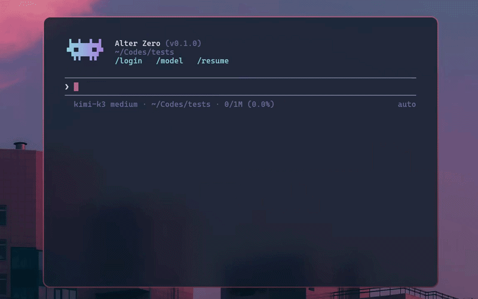

<div align="center">


# Alter Zero

### Give your terminal a coding agent.

Read, build, debug, and review code with an agent that works alongside you.<br>
Use the same tools for cybersecurity research, technical investigation, and everyday automation.

<p>
  <a href="https://www.rust-lang.org"></a>
  <a href="#quick-start"></a>
  <a href="https://github.com/linuztx/alter-zero/releases"></a>
  <br>
  <a href="LICENSE"></a>
  <a href="#support-the-project"></a>
  <a href="https://ko-fi.com/linuztx"></a>
</p>

[Quick start](#quick-start) ·
[Features](#features) ·
[Model providers](#model-providers) ·
[Commands & shortcuts](#commands--shortcuts) ·
[Support](#support-the-project) ·
[Acknowledgements](#acknowledgements)

</div>

<div align="center">

</div>

---

## Why Alter Zero

Alter Zero is an open-source AI coding agent written in Rust. It works directly in your project: reading files, making edits, running commands, and checking results while you follow along in your terminal. Coding is its focus, with the flexibility to investigate security issues, explore unfamiliar systems, and automate tasks using your existing tools.

| What you get | Why it matters |
| --- | --- |
| **Work you can follow** | Live command output, readable diffs, and a task checklist make progress easy to inspect. |
| **Control over execution** | Choose a permission mode, review proposed changes, and steer the agent while it works. |
| **Your choice of model** | Connect with a supported subscription or API key, or run local models with Ollama. |
| **Room to extend** | Add specialist subagents, reusable skills, lifecycle hooks, and MCP servers to fit your workflow. |
| **A native terminal experience** | A single Rust binary with persistent sessions, inline images, and keyboard-driven controls. |

## Quick start

Alter Zero runs on **Linux** (x86_64, arm64) and **macOS** (Intel, Apple silicon) in a modern terminal.

### Install

One line on Linux or macOS:

```bash
curl -fsSL https://raw.githubusercontent.com/linuztx/alter-zero/main/install.sh | sh
```

It picks the build for your machine, verifies its SHA-256 against the checksum published with the release, installs `alter-zero` into `~/.local/bin`, and tells you if that directory is not on your `PATH`.

<details>
<summary><strong>Install options</strong></summary>

Set `ALTER_ZERO_INSTALL_DIR` to install somewhere else, or `ALTER_ZERO_VERSION=vX.Y.Z` to pin a release. [`CHANGELOG.md`](CHANGELOG.md) records what changed between versions.

```bash
ALTER_ZERO_INSTALL_DIR="$HOME/bin" ALTER_ZERO_VERSION=v0.1.0 \
  sh -c "$(curl -fsSL https://raw.githubusercontent.com/linuztx/alter-zero/main/install.sh)"
```

For a manual install, each release's notes list every archive with its SHA-256, so you can download, verify, and extract one by hand.

</details>

### Build from source

You need [rustup](https://rustup.rs) and a C compiler. The repository pins the Rust toolchain, which rustup installs automatically.

```bash
git clone https://github.com/linuztx/alter-zero.git
cd alter-zero
cargo install --path .
alter-zero
```

Without a configured provider, Alter Zero opens an offline demo with scripted turns so you can explore the interface. To work on your own tasks:

1. Run **`/login`** and choose a supported subscription, API provider, or local model server. Follow the prompts to connect.
2. Run **`/model`** to choose a model. Alter Zero remembers your selection for this directory.
3. Describe a task, review any approval prompts, and follow the work as it happens.

Sign-ins added through `/login` are saved to `~/.alter-zero/.env`, outside your repository. Use `/` to browse commands or `?` in an empty composer to see shortcuts.

<details>
<summary><strong>Connect with environment variables</strong></summary>

You can also select your provider before launch. Set its API key variable and provider ID, then start the app. For example, with OpenRouter:

```bash
export OPENROUTER_API_KEY="your-api-key"
export ALTER_ZERO_PROVIDER=openrouter
alter-zero
```

Choose a model with `/model`, or set `ALTER_ZERO_MODEL` to its model ID before launching.

</details>

## Put it to work

Start with a concrete task and let the agent work through it with you.

| Use case | Try asking |
| --- | --- |
| **Coding and debugging** | "Find why this test fails, fix the cause, and run the relevant tests." |
| **Cybersecurity research** | "Review this repository for security vulnerabilities. Trace each finding to the code and suggest a fix." |
| **Technical investigation** | "Trace how authentication works in this project and explain where access checks happen." |
| **Automation** | "Write a script that summarises these logs and flags recurring errors." |

## Model providers

Connect to a supported subscription service, API provider, or local model server. Use `/login` to connect and `/model` to choose your model.

| Provider | How you connect | Good to know |
| --- | --- | --- |
| **Agent Zero API** | API key. | Accesses Venice.ai models through the Agent Zero proxy, with a free daily quota for [A0T](https://www.agent-zero.ai/p/token/) token holders. |
| **GitHub Copilot** | Subscription, using a one-time device code. | Model capabilities, including context window, vision, and reasoning levels, come from Copilot. |
| **OpenAI (ChatGPT)** | Browser sign-in with a ChatGPT Plus or Pro account. | Uses the account sign-in flow; no API key to paste. |
| **Anthropic** | API key or account sign-in through the Anthropic Console. | Usage is billed to your API organisation with either method. |
| **OpenRouter** | API key. | Access models from multiple providers through one account. |
| **Ollama** | Point Alter Zero at your local server; no key required. | Run inference on your own machine with locally hosted models. |
| **Ollama Cloud** | API key. | Use open models hosted by Ollama. |

The footer shows your active model, thinking mode, and context usage. **Ctrl+T** cycles the model's supported reasoning levels, vision support is checked before sending images, and requests support prompt caching where the provider allows it.

## Features

### Follow the work as it happens

- **Readable file changes.** Numbered, syntax-highlighted file views and diffs highlight the characters that changed, so edits are easy to review.
- **Live commands and task progress.** Command output streams into the conversation, long results collapse into expandable previews, and a checklist tracks multi-step work.
- **Parallel and background work.** Tool batches are announced before execution. Move a running command to the background with **Ctrl+B**, then use **Down** from an empty composer to inspect or stop it.
- **Decisions in context.** Inline questions support multiple-choice and free-text answers. Send a message with **Enter** to steer the running turn, or use **Tab** to queue a follow-up.

### Choose how much control to keep

- **Review at the approval prompt.** Inspect proposed file content, diffs, and commands before approving them. Approve once, allow a session rule, or reject with instructions using **Tab**. **Ctrl+E** asks for a command explanation.
- **Four permission modes.** `manual` asks before file changes and commands; `edit` allows file changes; `auto` adds a reviewer for routine commands; `master` runs unattended. Cycle modes with **Shift+Tab** and keep rules per project.
- **Checkpoints and rewind.** Enable checkpoints per directory to snapshot your working files in a separate store. **Esc Esc** returns to an earlier message and, when a checkpoint is available, restores the files with it.
- **Project trust.** Review project-defined agents, hooks, and MCP servers with `/trust` before they can run.

### Give the agent the right tools

- **Subagents.** Delegate focused work to agents with their own context, model, and tool access. Built-in `general-purpose` and `explore` agents are editable, and you can open a running agent's session to chat, send follow-up work, or stop it.
- **Skills.** Add reusable `SKILL.md` folders, mention one with `$`, or browse them with `/skills`. A built-in `skill-creator` helps you write your own.
- **MCP servers.** Connect tools over stdio, HTTP, or SSE, including remote servers with OAuth. Manage connections with `/mcp` or `alter-zero mcp`.
- **Hooks and project instructions.** Use `hooks.json` to approve, reject, or adjust tool calls and supply context. `AGENTS.md` files carry your project's conventions; `/init` helps create one.

### Pick up where you left off

- **Saved conversations.** `/resume` opens a searchable session picker. Use `--continue` for the latest session in this directory or `--resume <id>` for a specific one.
- **Settings that stay with the project.** Model choices, permissions, skills, and appearance are remembered per directory. Input history carries across sessions and is searchable with **Ctrl+R**.
- **Managed context.** `/compact` summarises long conversations, with automatic compaction as the context window fills. A session scratchpad holds temporary scripts and notes outside your project.

### Make the terminal yours

- **Rich output.** Stream Markdown, tables, highlighted code, and collapsible reasoning blocks, with clickable URLs and file paths in supported terminals.
- **Inline images.** Paste screenshots with **Ctrl+V**. Images render natively in kitty, iTerm2, and sixel terminals, with a character-based fallback elsewhere.
- **Inspect the session.** **Ctrl+O** opens the expanded transcript; **Ctrl+D** shows the context sent to the model. Start a line with `!` for a shell command or use `@` to pick a file.
- **Live customisation.** Preview eleven themes with `/theme`, six mascots with `/mascot`, and nine spinner styles with `/spinner`. `/settings` brings the remaining controls together in a searchable menu.

## Commands & shortcuts

The essentials are always one keystroke away: `/` opens commands, and `?` in an empty composer shows shortcuts.

<details>
<summary><strong>Slash commands</strong></summary>

| Command | What it does |
| --- | --- |
| `/help` | List the available commands |
| `/clear` | Clear the conversation |
| `/copy` | Copy the last response to the clipboard |
| `/init` | Create an `AGENTS.md` contributor guide |
| `/compact` | Summarise the conversation to free up context |
| `/resume` | Resume a saved chat |
| `/model` | Switch the active model |
| `/login` | Add or update a provider sign-in |
| `/settings` | Open the settings menu |
| `/theme` | Choose the colour theme |
| `/mascot` | Choose the banner mascot |
| `/spinner` | Choose the status spinner style |
| `/hooks` | Browse the configured lifecycle hooks |
| `/skills` | Browse skills and enable or disable each one |
| `/mcp` | Manage MCP servers |
| `/trust` | Review and approve this project's config |
| `/donate` | Support the project with a crypto donation |
| `/quit` | Exit the app |

</details>

<details>
<summary><strong>Keyboard shortcuts</strong></summary>

| Key | Action |
| --- | --- |
| `Enter` | Send, or hand a message to the running turn |
| `Tab` | Queue a follow-up turn |
| `Alt+↑` | Pull a queued message back to edit |
| `Shift+Enter` / `Ctrl+J` | Insert a newline |
| `↑` / `↓` | Recall input history |
| `Ctrl+R` | Search input history |
| `Esc` | Interrupt the running turn |
| `Esc Esc` | Step back to a previous message and rewind |
| `Ctrl+O` | Open the full transcript |
| `Ctrl+D` | Show the context sent to the model |
| `Ctrl+T` | Cycle the thinking mode |
| `Shift+Tab` | Cycle the permission mode |
| `Ctrl+B` | Move a running command or agent to the background |
| `↓` (empty composer) | Manage background shells and agents |
| `Ctrl+V` | Paste an image |
| `!` | Run a shell command |
| `@` | Pick a file path |
| `$` | Mention a skill |
| `/` | Open the command palette |
| `Ctrl+W` / `Ctrl+U` / `Ctrl+K` | Delete the previous word, to the start of the line, to the end of the line |
| `Ctrl+C` | Clear the draft, then quit |

</details>

<details>
<summary><strong>Command-line options</strong></summary>

```text
Usage: alter-zero [OPTIONS] [PROMPT]
       alter-zero mcp <COMMAND>
       alter-zero update

Arguments:
  [PROMPT]        Send this message as the first turn

Options:
  -c, --continue     Continue the most recent conversation in this directory
  -r, --resume [ID]  Resume a conversation by id, or pick one from a list
  -h, --help         Print help
  -V, --version      Print version
```

Start a task directly, or continue the work from your last session:

```bash
alter-zero "fix the failing test"
alter-zero -c "now review the changes"
```

Run `alter-zero mcp --help` for MCP server management commands, and `alter-zero update` to install the newest release over the binary you are running.

</details>

## Where things live

Your sign-ins, saved sessions, input history, and per-directory settings live under `~/.alter-zero/`. Keep shared extensions there, or add project-specific ones alongside your code.

<details>
<summary><strong>Configuration and extension paths</strong></summary>

| Location | Contents |
| --- | --- |
| `~/.alter-zero/.env` | Keys and tokens saved through `/login` |
| `~/.alter-zero/agents/` and `~/.alter-zero/skills/` | Your shared agent definitions and skills |
| `~/.alter-zero/hooks.json` and `~/.alter-zero/mcp.json` | Your shared hooks and MCP servers |
| `.alter-zero/` in a project | Project-specific `agents/`, `skills/`, `hooks.json`, and `mcp.json` |
| `AGENTS.md` | Project instructions read by the agent |

Claude Code-style `.claude/skills/` and `.mcp.json` files are also supported. Project-defined agents, hooks, and MCP servers require approval through `/trust`.

</details>

## Support the project

Alter Zero is free and open source. If it earns a place in your terminal, a donation keeps the work going. `/donate` shows these addresses inside the app, each in a copyable box.

| Coin | Supported network(s) | Address |
| --- | --- | --- |
| BTC (Bitcoin) | Bitcoin Native SegWit | `bc1qhwamfrwuhz64pk00l75ykfff2ang22ns64chf7` |
| ETH (Ethereum) | Ethereum, Linea, Base, Arbitrum, BNB Chain, OP, Polygon | `0xEAf6fbabB9DBE7a23BfE22A7A6c4aCe02063524b` |
| SOL (Solana) | Solana | `Gwhv5c6uAa6aAz1MjwzV9QJpbm7CJWy2kuCeZ75mFc94` |

> **Important:** Send only on a network listed for that address. Confirm that the asset and selected network match before sending. An address may look valid on another network, but funds sent on an unlisted or mismatched network may be unrecoverable.

Thank you.

## License

Alter Zero is released under the [Apache License 2.0](LICENSE). Copyright 2026 [linuztx](https://github.com/linuztx).

## Acknowledgements

Alter Zero is made possible by the people, projects, and communities behind it:

- [Agent Zero](https://agent-zero.ai) and its team for supporting the development of Alter Zero, including the free [A0T](https://www.agent-zero.ai/p/token/) inference credits used during testing.
- [Claude Code](https://claude.com/claude-code) and [Codex CLI](https://github.com/openai/codex) for the interaction patterns that helped shape Alter Zero.
- [ratatui](https://ratatui.rs) and [crossterm](https://github.com/crossterm-rs/crossterm) for the foundation of the terminal UI.

See the additional [technical credits](docs/credits.md).